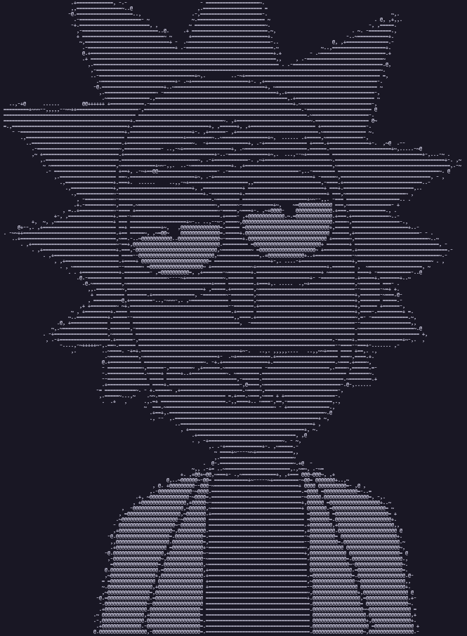

I've been playing around with [p5.js](https://p5js.org/) for creating generative sketches, and the urge to experiment with ASCII art struck. I built a browser based ascii art generator with p5.js, but the performance was abysmal. This led me down the path of building one with Rust, and let me tell you, it was a revelation. The Rust version was **blazingly** fast, super lightweight, and surprisingly straightforward to create.

Now, let's dive in and see how you can build your own terminal ASCII art generator in Rust!

## Setting Up the Project

1. **Create a new Rust project:**

    Open your terminal and run `cargo init <project_name>`. Replace `<project_name>` with your desired name (e.g., `rascii`). This command creates the basic structure for your Rust project.

2. **Add Dependencies:**

    We'll be using the `image` crate to handle image manipulation. Add the following line to your `Cargo.toml` file located in the project root directory:

    ```toml
    [dependencies]
    image = "0.25.0"
    ```

3. **Install Dependencies:**

    Run `cargo build` in your terminal to download and install the `image` crate for your project.

## Understanding the Code

Now, let's break down the core functionality of the code step-by-step:

**1. Importing the `image` crate:**

```rust
use image::{ GenericImageView };
```

This line brings the functionality of the `image` crate into scope for our program. We use the `GenericImageView` trait, which allows us to work with different image formats.

**2. `get_ascii` Function:**

```rust
fn get_ascii(intent: u8) -> &'static str {
    let index = intent / 32;
    let ascii = [" ", ".", ",", "-", "~", "+", "=", "@"];
    return ascii[index as usize];
}
```

This function takes an `intent` value (represented as an unsigned 8-bit integer) and converts it into an ASCII character representing the brightness level.

-   `intent` is calculated by averaging the red, green, and blue (RGB) values of a pixel.
-   The function uses a pre-defined array `ascii` containing various characters representing different brightness levels. (" " for darkest, "@" for brightest).
-   It divides `intent` by 32 to get an index into the `ascii` array.
-   Finally, it returns the corresponding ASCII character at that index.

**3. `get_image` Function:**

```rust
fn get_image(dir: &str, scale: u32) {
    let img = image::open(dir).unwrap();
    let (width, height) = img.dimensions();
    for y in 0..height {
        for x in 0..width {
            if y % (scale * 2) == 0 && x % scale == 0 {
                let pix = img.get_pixel(x, y);
                let mut intent = pix[0] / 3 + pix[1] / 3 + pix[2] / 3;
                if pix[3] == 0 {
                    intent = 0;
                }
                print!("{}", get_ascii(intent));
            }
        }
        if y % (scale * 2) == 0 {
            println!("");
        }
    }
}
```

This function handles loading and processing the image:

-   It takes the image path (`dir`) and a scaling factor (`scale`) as arguments.
-   It opens the image using `image::open` and gets its dimensions (`width` and `height`).
-   It iterates through each pixel (represented by `x` and `y` coordinates). However, it only processes pixels at specific intervals determined by the `scale` value. This helps reduce the number of pixels analyzed and creates a blockier but faster ASCII representation.
-   For each selected pixel, it retrieves its RGB values using `img.get_pixel(x, y)`.
-   It calculates the average brightness (`intent`) by dividing the sum of RGB values by 3.
-   If the alpha channel value (`pix[3]`) is 0 (indicating a transparent pixel), it sets the `intent` to 0 (completely black).
-   The function calls `get_ascii` with the calculated `intent` to get the corresponding ASCII character.

**4. `main` Function:**

```rust
fn main() {
    get_image("rick.png", 2);
}
```

The `main` function is the entry point of our program. Here, it calls the `get_image` function with the path to your image ("rick.png") and a scaling factor of 2. You can adjust the scaling factor to control the detail level of the resulting ASCII art.

**Running the Program:**

1. Save the code in a Rust file (e.g., `ascii_art.rs`).
2. Open your terminal, navigate to the directory containing your Rust file, and run `cargo run`.

This will execute the program, analyze the image, and print the corresponding ASCII art representation in your terminal.

Here's mine:



and the [Source Code](https://github.com/x0bd/rascii).

**And There You Have It!**

With this code, you've built a simple yet effective ASCII art generator in Rust. Experiment with different images and scaling factors to see how they affect the output.

**Thank You and Keep Creating!**
