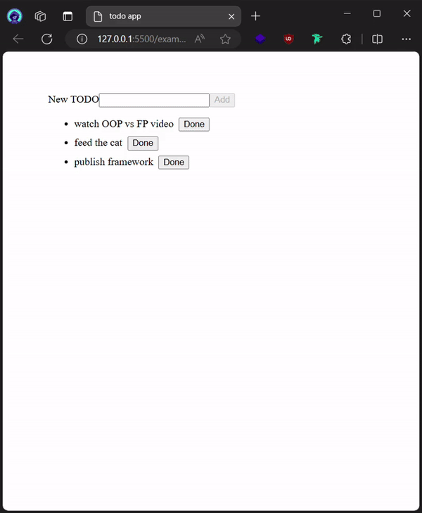

"Ever heard someone say 'Frontend Frameworks Are Magic!' hanging out on Discord or reading threads on X? Well, I used to think so too!"

When I first started building user interfaces (UIs), mostly in game engines like Unity and Godot, it was a fairly straightforward process. It involved dragging and dropping components within the engine and writing code specific to those elements.

However, when I transitioned to web development using frameworks like React, the declarative approach and the somewhat mysterious inner workings piqued my curiosity.

Fast forward to enrolling in Jonas Schmedtmann's [Ultimate React Course](https://www.udemy.com/course/the-ultimate-react-course/). He had a whole section explaining the magic behind the scenes, but let's be honest, 10+ hours of deep engineering theory can be overwhelming.

But the urge to understand this "magic" lingered. So, here I am, building my own framework to unveil the secrets!

This post will cover the tech stack I'll be using, the planned features, and the knowledge I hope to gain along the way.

### The Tech Stack

The JavaScript ecosystem thrives on passionate debates about tools. This project will avoid those distractions and focus on core functionalities. Here's the chosen tech stack:

-   **Build Tool:** npm - While pnpm offers workspace functionality, I'm still getting comfortable with it. For this project, I'll stick with the familiar npm.
-   **Bundler:** Rollup - My daily driver is Vite, but this project provides the perfect opportunity to explore Rollup and its benefits based on recommendations.
-   **Linting and Formatting:** ESLint and Prettier - This well-established combination ensures clean and consistent code.
-   **Testing:** Vitest - This is my current favorite testing framework.
-   **Language:** JavaScript - Since this is a learning project, I want to prioritize the core concepts without getting bogged down in type systems. However, JavaScript allows for exploring JSDoc for code documentation.

## Roadmap

This framework will explore various functionalities that make frontend frameworks powerful. Here's what I plan to build:

**Implemented Features:**

-   Virtual DOM, Mounting, and Destroying
-   State Management

**Future Features:**

-   Advanced Components
    -   Stateful Components
    -   Component Methods
    -   Sub-components
-   Keyed Lists
-   Hooks
-   Asynchronous Components
-   TypeScript Support
-   Server-Side Rendering
-   Slots
-   Browser extension for component inspection

<!-- Implement Here -->

Now that we have the virtual DOM, mounting, and state management working together, Glyph is a functional bare-bones framework! This allows us to build basic web applications. As a demonstration, check out the classic todo app built with Glyph in the video,

Here's the [source code](https://github.com/x0bd/glyph-ui) and the awesome [book](https://www.manning.com/books/build-a-frontend-web-framework-from-scratch) I'm reading.

Thanks for reading and happy coding!
