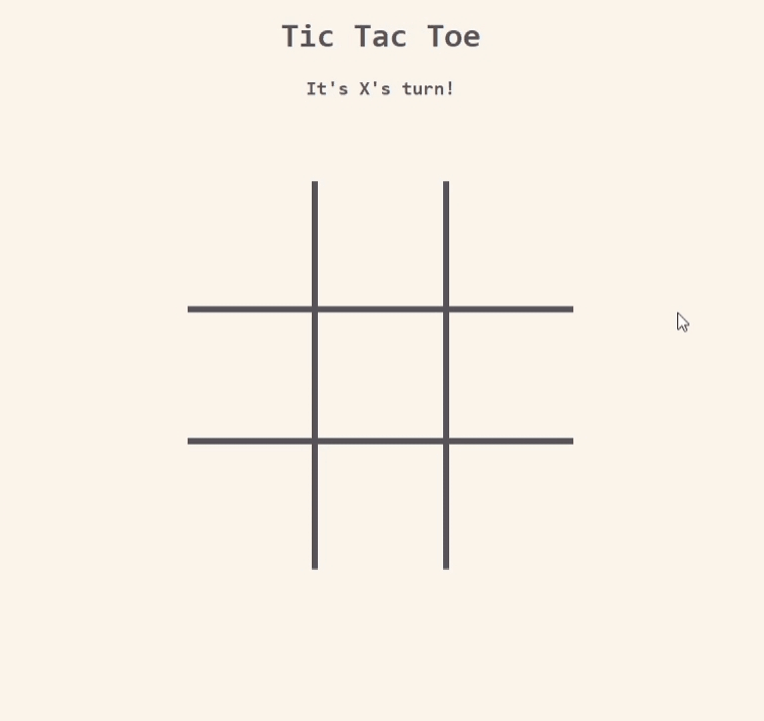

Glyph, the new lightweight frontend framework I'm building to learn how UI frameworks work (and yes, it aims to be performant! better than React, btw), is built with simplicity and performance in mind. In this post, I will dive into the core concepts illustrated through a fun game of Tic-Tac-Toe built with Glyph and JavaScript

It's still a bare bones framework, missing a lot of fundamental features, but turns out you only need virtual DOM manipulation and state management to build a _frontend framework_.

Before we get into the technical bits here's the game:



### Virtual DOM Manipulation

Glyph utilizes a virtual DOM for efficient UI updates. Unlike directly manipulating the DOM, Glyph creates a lightweight virtual representation of the UI. This virtual representation is then compared to the actual DOM, and only the necessary changes are applied. Let's see this in action with the Tic-Tac-Toe board:

```js
const Board = (state, emit) => {
	const freezeBoard = state.winner || state.draw;

	return h("table", { class: freezeBoard ? "frozen" : "" }, [
		h(
			"tbody",
			{},
			state.board.map((row, i) => Row({ row, i }, emit))
		),
	]);
};
```

Here, the `Board` component generates a virtual table element (`h("table")`) and populates it with rows (`state.board.map`) using the `Row` component. This virtual representation is lightweight and allows for efficient comparisons with the actual DOM.

### State Management

Glyph offers a reactive state management system. Changes to the state trigger a re-render of the UI components that depend on that state. In our Tic-Tac-Toe game, the current player (`state.player`) and the board state (`state.board`) are crucial pieces of information.

```js
const View = (state, emit) => {
	return hFragment([Header(state), Board(state, emit)]);
};

const Header = (state) => {
	if (state.winner) {
		return h("h3", { class: "win-title" }, [
			`Player ${state.winner} wins!`,
		]);
	}
	// ...
	return h("h3", {}, [`It's ${state.player}'s turn!`]);
};
```

The `View` component renders both the `Header` and `Board` components, which rely on the current state (`state`). If the player changes (`state.player`) or a move is made (`state.board` updates), the `View` will re-render the `Header` and `Board` components with the updated information.

### UI Components

Glyph promotes building reusable components. Components receive data (props) and define how that data translates to the UI. In our Tic-Tac-Toe game, each cell on the board is represented by a `Cell` component.

_Note: UI Components are still a premature feature, they are not yet fully \*reusable_.

```js
const Cell = ({ cell, i, j }, emit) => {
	const mark = cell
		? h("span", { class: "cell-text" }, [cell])
		: h(
				"div",
				{
					class: "cell",
					on: { click: () => emit("mark", { row: i, col: j }) },
				},
				[]
		  );

	return h("td", {}, [mark]);
};
```

The `Cell` component receives the cell value (`cell`), its row index (`i`), and column index (`j`) as props. It conditionally renders either the current mark (X or O) or an empty cell that triggers a `mark` event when clicked, passing the row and column information. This demonstrates how components encapsulate UI logic and interact with the state through events.

### Rendering and Diffing

Glyph is still under development, and currently, the entire application re-renders whenever the state changes. This is because the diffing algorithm, which is responsible for identifying minimal DOM changes, hasn't been fully implemented yet.

In an ideal scenario, once the state is updated by the reducer, Glyph would perform diffing to determine the most efficient way to update the UI. This would minimize unnecessary re-renders and improve overall performance.

Let's visit the `Board` component:

```js
const Board = (state, emit) => {
	// ...

	return h("table", { class: freezeBoard ? "frozen" : "" }, [
		h(
			"tbody",
			{},
			state.board.map((row, i) => Row({ row, i }, emit))
		),
	]);
};
```

Here, when the `state.board` updates due to a move, Glyph **should** compare the new virtual representation of the board (`state.board.map`) with the previous one. It then identifies the minimal DOM changes needed, such as updating the content of a cell (`Cell` component) or adding/removing a class from the table element (`"frozen"` class).

### Event Handling

Glyph provides a mechanism for handling user interactions like clicks, touches, and form submissions. These events can trigger state updates or other actions within the application.

In our Tic-Tac-Toe game, clicking on an empty cell triggers the `mark` event:

```js
const Cell = ({ cell, i, j }, emit) => {
	// ...

	return h("td", {}, [
		mark,
		h(
			"div",
			{
				class: "cell",
				on: { click: () => emit("mark", { row: i, col: j }) },
			},
			[]
		),
	]);
};
```

The `Cell` component attaches a click event handler to the empty cell (`div` element). When clicked, it emits a `mark` event with the clicked cell's row and column information (`{ row: i, col: j }`). This event is then handled by the game logic to update the game state.

This walkthrough provides a glimpse into Glyph's core functionalities through the lens of a Tic-Tac-Toe game. By understanding these concepts, you can leverage Glyph to build your apps.

To follow along, install the framework into a Vite project using the following command with your preferred package manager:

```bash
pnpm add glyphui
```

Alternatively, you can take a look at the [project repository](https://github.com/x0bd/glyph-ui) to gain a deeper understanding and explore other examples.

Thank you for reading!
