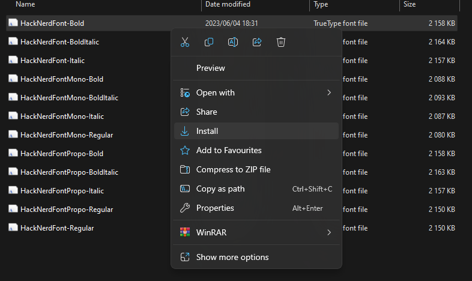

If you're a developer in 2023 still using the Windows CMD for your daily tasks, you're probably feeling like the last kid picked for the dodgeball team in PE class. While your friends on Linux and macOS are running around with their fancy terminals, you're left alone in the corner with your basic command prompt. But don't despair! With a bit of work, we can turn this situation around and make your terminal the envy of colleagues. So buckle up, and let's the Windows Terminal from zero to hero!

### Install and Configure Nerd Font - Hack

First things first, let's give your terminal a makeover. We'll start by installing a Nerd Font. Nerd Fonts takes popular fonts and adds a bunch of glymphs. We'll be using Hack for this tutorial.

- Download Hack Nerd Font from the [Nerd Fonts Github page](https://github.com/ryanoasis/nerd-fonts/releases)
- Extract the zip file and install the font by right-clicking on the `.ttf` file and selecting "Install"

Now, let's configure the Windows Terminal to use this font.

- Open Windows Terminal and go to Settings (the gear icon).
- Under "Profile" -> "Defaults", find the "Font Face" setting and replace it "Hack Nerd Font"
