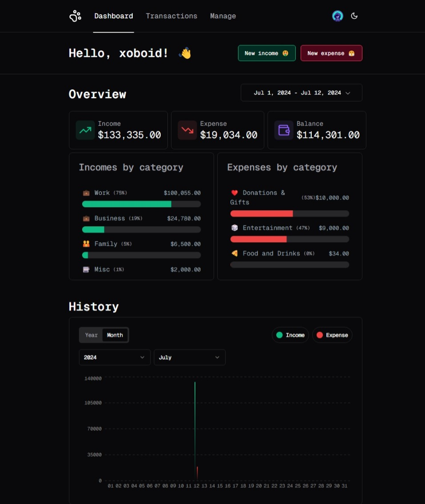
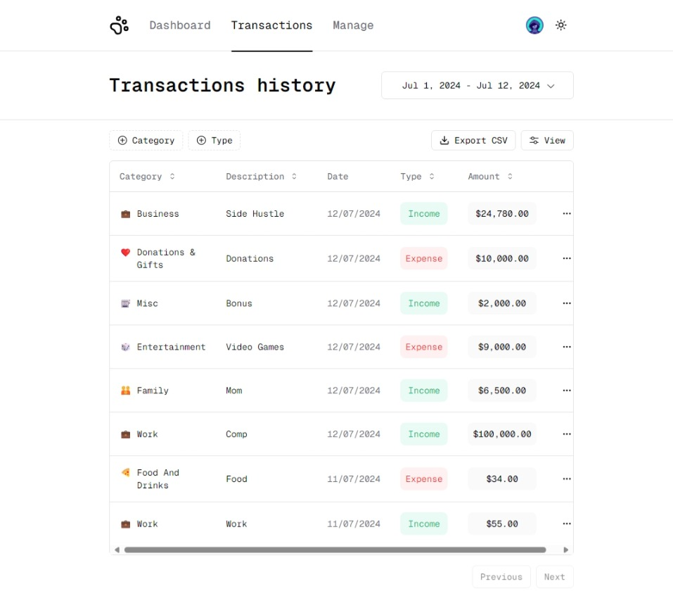
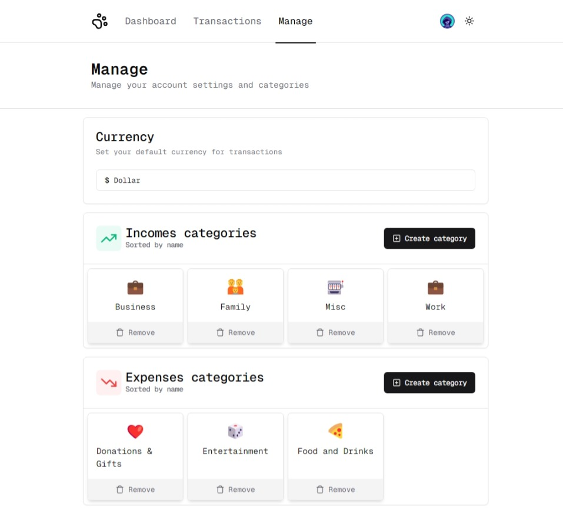

A Tiny Finance Tracker App I built whilst learning TanStack Query.

## Screenshots

#### Dashboard

_dashboard which is also your homepage after signing in_

#### Transactions Page

#### Manage Page

## Features Include

-   A Dashboard with a summary of your finances
-   Transactions page with a list of all your transactions
-   Ability to Export your data as a CSV
-   Account Management (Currency, Categories, Add and Remove Transactions)
-   Light/Dark Mode

## Tech Stack

-   Next.js 14
-   Shadcn/UI
-   TypeScript
-   Prisma ORM
-   SQLite (Local dev db)
-   Clerk Auth
-   TailwindCSS
-   Vercel PostgreSQL (Serverless Production db)
-   TanStack Query
-   Vercel
