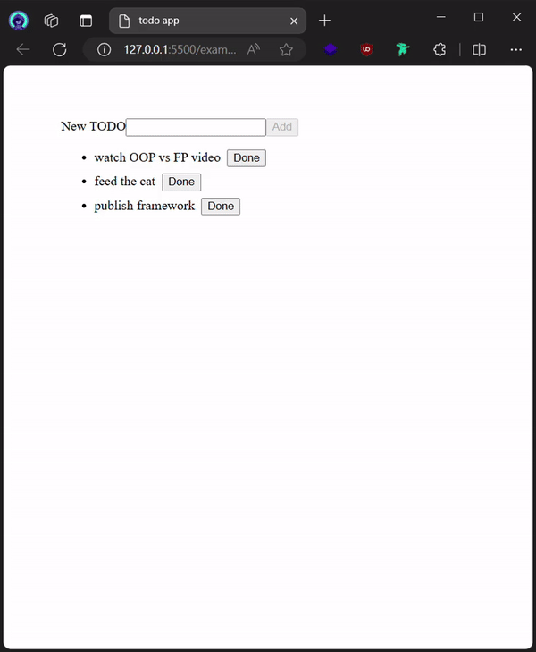
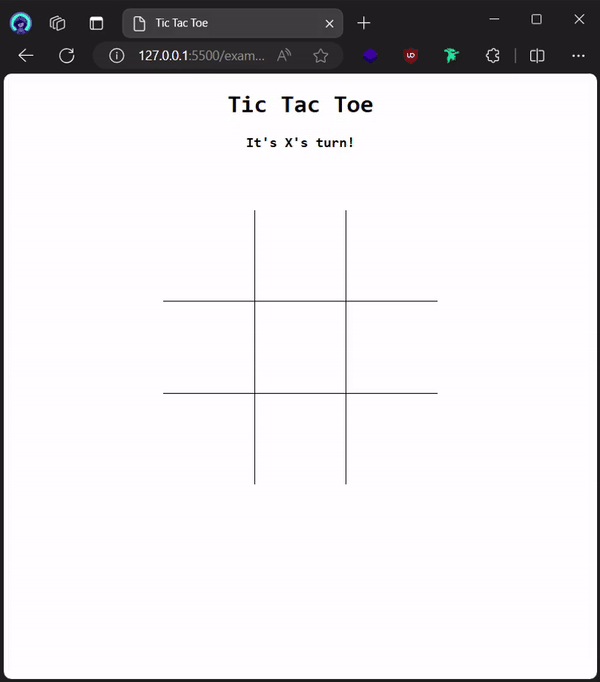
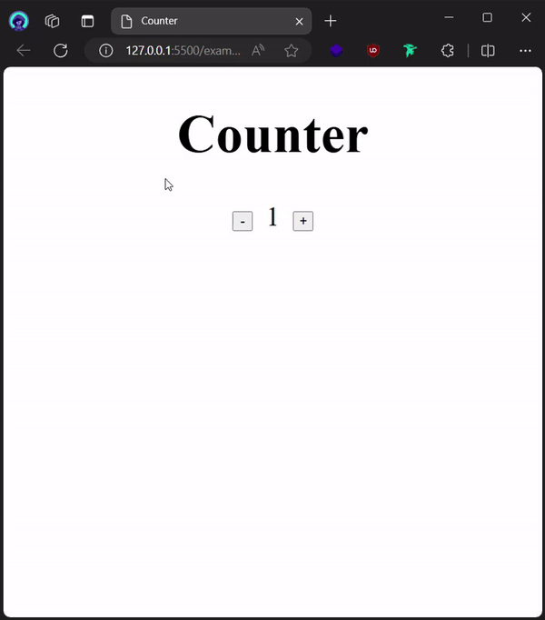

Glyph is a modern JavaScript frontend framework that is heavily inspired by React, Svelte and Vue. I am building the framework to better understand how these engineering marvels work under the hood.

##### Tech Stack

-   JavaScript
-   Rollup
-   NPM
-   Vitest

### Example Apps built with the framework

#### Todo App

#### Tic Tac Toe

#### Counter

_counter app_

If you want to learn more about the project, check my [blog](/blog).
