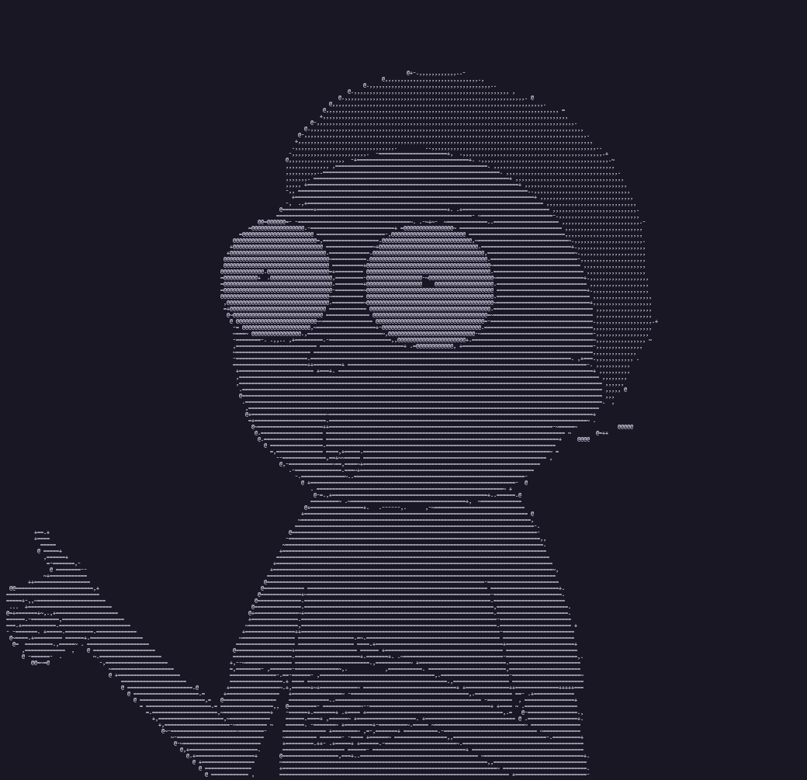

Rascii is a super fast and lightweight image to ascii art generator that runs on the terminal. I built the app as an interesting way of learning rust and creative coding.

_Morty Smith ascii art_

Built with Rust🦀.
