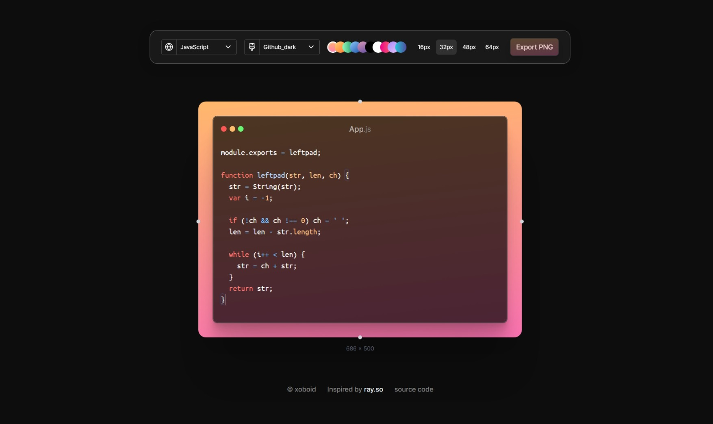

Snap.xo is a beautifully crafted app to create and share snaps of your code. It is inspired by [raycast's](https://raycast.com) ray.so app.

#### Screenshots

_\*you can specify your own color schemes and backgrounds_

##### Tech Stack

-   Next.js 14 (App Router)
-   TailwindCSS
-   TypeScript
-   Vercel (hosting)
